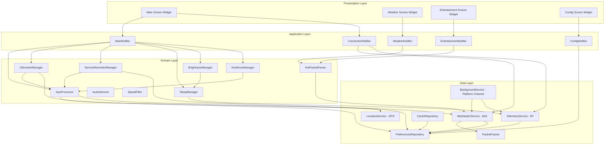

# Design Document: Flutter Golf Cart Computer

## Overview

This document describes the design for the Flutter Golf Cart Computer (GCD) application — a cross-platform port of the native Android Golf Cart Display Computer. The Flutter version targets both Android and iOS, providing identical functionality while leveraging Flutter's cross-platform capabilities and Dart's reactive programming model.

The application communicates with two external Bluetooth devices simultaneously: a Meshtastic radio (GCM) via BLE for mesh messaging and GPS, and a Golf Cart Internal computer (GCI) via Bluetooth for vehicle telemetry (battery voltage, fuel level, temperature, headlight status).

### Key Design Decisions

1. **Flutter with Dart** — Cross-platform UI and business logic in a single codebase. Platform channels handle platform-specific background execution and Bluetooth Classic (Android only).
2. **Riverpod for state management and DI** — Provides compile-time safe dependency injection, reactive state propagation, and testability through provider overrides. Replaces Hilt + StateFlow from the Android version.
3. **Four-layer architecture** — Presentation, Application, Domain, Data. The Application layer (state notifiers/controllers) bridges Domain logic and Presentation, keeping widgets thin and domain logic pure.
4. **flutter_blue_plus for BLE** — Mature cross-platform BLE plugin with stream-based APIs that map naturally to Riverpod's reactive model.
5. **protobuf Dart package with protoc-gen-dart** — Generates Dart classes from Meshtastic `.proto` files, providing type-safe protobuf serialization identical to the Android Wire-generated classes.
6. **Platform channels for background execution** — Android uses a foreground service (via platform channel or flutter_background_service); iOS uses `bluetooth-central` and `location` background modes declared in Info.plist.
7. **shared_preferences for simple settings, hive for structured cache** — shared_preferences handles key-value user preferences; hive handles structured cached data (weather packets, venue data) with efficient binary storage.

## Architecture



### Layer Responsibilities

| Layer | Responsibility | Key Technologies |
|-------|---------------|-----------------|
| **Presentation** | Render state via widgets, capture user input | Flutter Widgets, Material 3, adaptive layouts |
| **Application** | State notifiers, coordinate domain logic, expose state to UI | Riverpod StateNotifier/AsyncNotifier |
| **Domain** | Pure business logic, data transformation, algorithms | Plain Dart classes, no framework dependencies |
| **Data** | External communication, persistence, platform APIs | flutter_blue_plus, geolocator, protobuf, shared_preferences, hive, platform channels |

### Dependency Injection (Riverpod)

Riverpod providers are organized by layer:

- **Data providers** — `meshtasticServiceProvider`, `telemetryServiceProvider`, `locationServiceProvider`, `preferencesRepositoryProvider`, `cacheRepositoryProvider`
- **Domain providers** — `gpsProcessorProvider`, `odometerManagerProvider`, `serviceReminderProvider`, `hotPacketParserProvider`, `sleepManagerProvider`, `brightnessManagerProvider`, `geofenceManagerProvider`, `audioServiceProvider`, `speedFilterProvider`
- **Application providers** — `mainNotifierProvider`, `weatherNotifierProvider`, `entertainmentNotifierProvider`, `configNotifierProvider`, `connectionNotifierProvider`

Provider overrides enable full testability without mocks for domain logic, and mock-based testing for data layer services.

## Components and Interfaces

### 1. MeshtasticService (Data Layer)

Manages the BLE connection to the Meshtastic radio using flutter_blue_plus.

```dart
abstract class MeshtasticService {
  Stream<ConnectionState> get connectionState;
  Stream<String> get nodeId;
  Stream<MeshPacket> get incomingPackets;

  Future<void> connect(String deviceId);
  Future<void> disconnect();
  Future<List<ScanResult>> scanForDevices({Duration timeout = const Duration(seconds: 10)});
  Future<void> sendTextMessage(String text, int destination, int channel);
  Future<void> sendAdminMessage(AdminMessage message);
  Future<void> setPositionConfig(PositionConfig config);
  Future<void> rebootRadio({int delaySeconds = 5});
}
```

**BLE Protocol Implementation:**
- Service UUID: `6ba1b218-15a8-461f-9fa8-5dcae273eafd`
- TORADIO characteristic: `f75c76d2-129e-4dad-a1dd-7866124401e7` (write)
- FROMRADIO characteristic: `2c55e69e-4993-11ed-b878-0242ac120002` (read)
- FROMNUM characteristic: `ed9da18c-a800-4f66-a670-aa7547e34453` (notify)

**Packet Framing:**
- Outbound: 4-byte big-endian length prefix + protobuf-encoded `ToRadio` bytes
- MTU handling: Split packets exceeding (negotiated MTU - 3) bytes; default safe payload 20 bytes

**Connection Lifecycle:**
1. Scan for devices matching name pattern `^.*_([0-9a-fA-F]{4})$`
2. Connect and negotiate MTU
3. Subscribe to FROMNUM notifications
4. Send `ToRadio(want_config_id=<random>)` to initiate handshake
5. Process `FromRadio` responses: `my_info` (extract node number), `config` (read position config), `config_complete_id` (handshake complete)
6. Enter steady state: 30-second heartbeat, 60-second liveness timeout
7. On disconnect: send `ToRadio(disconnect=true)` before closing

**Reconnection Strategy:**
- Exponential backoff starting at 2 seconds, doubling up to 60 seconds max
- Up to 10 reconnection attempts before requiring manual intervention
- Independent of GCI connection state

### 2. TelemetryService (Data Layer)

Manages the Bluetooth connection to the GCI ESP-32 computer.

```dart
abstract class TelemetryService {
  Stream<ConnectionState> get connectionState;
  Stream<TelemetryData> get telemetryData;

  Future<void> connect(String deviceAddress);
  Future<void> disconnect();
  Future<void> sendHeartbeat();
  Future<void> sendGpsData(GpsPayload gpsData);
  Future<void> sendIsHome(bool isHome);
  Future<void> sendIsDaytime(bool isDaytime);
  Future<void> pairNewDevice({Duration timeout = const Duration(seconds: 6)});
}
```

**Message Protocol (mirrors ESP-NOW structure):**
```
| type (1 byte) | timestamp (4 bytes LE) | seq_num (2 bytes LE) | data_len (2 bytes LE) | data (variable) |
```

Message types: TEXT(0), GPS_DATA(1), TELEMETRY(2), COMMAND(3), ACK(4), HEARTBEAT(5), IS_HOME(6), IS_DAYTIME(7)

**Telemetry Data Packet (20 bytes, little-endian, from GCI):**
- `modeLights` (int32) — headlight mode
- `outdoorLum` (int32) — outdoor luminosity
- `airTemp` (float32) — air temperature
- `battVolts` (float32) — battery voltage
- `fuel` (float32) — fuel level

**Platform-Specific Connection:**
- iOS: BLE connection to GCI
- Android: Bluetooth Classic SPP preferred, BLE fallback
- Platform channels bridge native Bluetooth Classic on Android

**Connection Management:**
- 10-second heartbeat interval
- 40-second timeout (4 missed heartbeats) marks GCI as disconnected
- 6-second pairing window with broadcast discovery + ACK handshake
- Exponential backoff reconnection: 2s, 4s, 8s... up to 60s max

### 3. LocationService (Data Layer)

Wraps the geolocator plugin for cross-platform GPS access.

```dart
abstract class LocationService {
  Stream<Position> get positionStream;
  Future<Position?> get currentPosition;
  Future<LocationPermission> requestPermission();
  Future<bool> get isServiceEnabled;
}
```

- 1-second update interval via `Geolocator.getPositionStream()`
- Platform-appropriate permission requests via permission_handler
- Background location updates via iOS `location` background mode and Android foreground service

### 4. PacketFramer (Data Layer)

Handles framing and unframing of protobuf messages with 4-byte big-endian length prefixes.

```dart
class PacketFramer {
  /// Frames a protobuf payload with a 4-byte big-endian length prefix.
  Uint8List frame(Uint8List payload);

  /// Unframes a received buffer, extracting the payload after the length prefix.
  /// Returns null if the buffer is too short or the length prefix is invalid.
  Uint8List? unframe(Uint8List framedData);

  /// Splits a framed packet into MTU-sized chunks for BLE write.
  List<Uint8List> splitForMtu(Uint8List framedData, int mtuSize);
}
```

### 5. GpsProcessor (Domain Layer)

Processes raw GPS data from the device sensor and/or Meshtastic position packets.

```dart
abstract class GpsProcessor {
  Stream<ProcessedGpsData> get gpsState;
  Stream<NavigationData> get navigationData;
  void processRawPosition(RawPosition position);
  void processMeshtasticPosition(MeshtasticPosition position);
}
```

**Speed Filtering Algorithm (via SpeedFilter):**
1. Filter speeds below 2.5 mph to zero (GPS dither elimination)
2. Reject speed spikes exceeding 8 mph/second acceleration
3. When speed < 4 mph and decreasing → report zero (responsive stop detection)
4. Require 2 consecutive readings above threshold before reporting movement (3 when dimmed)
5. If speed invalid but location valid and last speed < 5 mph → report zero

**Heading:** Convert bearing degrees to 16-point cardinal direction using 22.5° intervals.

**Satellite/HDOP:**
- Require 3 consecutive zero-satellite readings before displaying zero
- Estimate HDOP when unavailable: ≥6 sats = 1.5, 4-5 sats = 2.0, <4 sats = 99.0

### 6. SpeedFilter (Domain Layer)

Pure function class implementing the GPS speed filtering pipeline.

```dart
class SpeedFilter {
  /// Applies the full speed filtering pipeline to a raw speed reading.
  /// Returns the filtered speed in mph.
  FilterResult filter(double rawSpeedMph, double elapsedSeconds, {bool isDimmed = false});

  /// Resets the filter state (e.g., on GPS signal loss).
  void reset();
}

class FilterResult {
  final int filteredSpeedMph;
  final bool isMoving;
  final bool wasDiscarded;
}
```

### 7. HotPacketParser (Domain Layer)

Parses structured data packets received via Meshtastic text messages.

```dart
class HotPacketParser {
  /// Returns true if the text starts with '|' (HoT packet indicator).
  bool isHotPacket(String text);

  /// Extracts the packet type code (01=weather, 02=venue/event).
  int? parsePacketType(String text);

  /// Parses a weather packet. Returns null if validation fails.
  WeatherData? parseWeatherPacket(String rawPacket);

  /// Parses a venue/event packet. Returns null if validation fails.
  List<VenueEvent>? parseVenueEventPacket(String rawPacket);
}
```

**Weather Packet Format:** `|#01#<current_temp>#<hr>,<glyph>,<temp>,<precip>#...#` (4 forecast hours)
- Validation: exactly 7 `#` delimiters and 12 `,` delimiters
- Temperature range: -99 to 999
- Hour labels: ≤6 characters
- Precipitation range: 0.0 to 100.0
- Zero precipitation (`0.0`) replaced with empty string

**Venue/Event Packet Format:** `|#02#<venue>,<event>#<venue>,<event>#...#`
- 1-12 venue/event pairs
- First comma in each pair separates venue from event (subsequent commas are part of event name)

### 8. OdometerManager (Domain Layer)

Accumulates distance using GPS position calculations.

```dart
abstract class OdometerManager {
  Stream<OdometerState> get odometerState;
  void processPosition(ProcessedGpsData gpsData);
  void resetTripOdometer();
  Future<void> persist();
}
```

**Distance Accumulation Rules:**
- Only accumulate when filtered speed > 0 (Doppler speed gating)
- Minimum position change: 2.6 feet (0.0005 miles) with Doppler confirmation
- Fallback minimum (no Doppler): 10 feet (0.002 miles)
- Reject position-based speed > 30 mph as GPS error
- Total odometer rolls over at 100,000.0 miles
- Trip odometer rolls over at 10,000.0 miles
- Persist every 0.5 miles and before sleep/shutdown

### 9. ServiceReminderManager (Domain Layer)

Tracks driving hours for maintenance reminders.

```dart
abstract class ServiceReminderManager {
  Stream<ServiceState> get serviceState;
  void accumulateTime(double deltaSeconds, bool isMoving);
  void resetHours();
  Future<void> persist();
}
```

- Accumulates only when speed > 0
- Stores in tenths of hours (6-minute resolution)
- Only accepts time deltas > 0 and ≤ 10 seconds
- Persists every 1.0 hours of driving
- Configurable service interval (1-500 hours, default 100)

### 10. SleepManager (Domain Layer)

Implements the three-state power management system.

```dart
enum OperatingMode { startupGrace, gciMode, standaloneMode }

abstract class SleepManager {
  Stream<OperatingMode> get operatingMode;
  void onGciConnected();
  void onGciDisconnected();
  void onGracePeriodExpired();
}
```

**State Transitions:**
- STARTUP_GRACE → GCI_MODE: GCI connects during grace period
- STARTUP_GRACE → STANDALONE_MODE: Grace period expires without GCI
- GCI_MODE → STANDALONE_MODE: GCI disconnected for timeout period
- STANDALONE_MODE → GCI_MODE: GCI reconnects

**GPS Interval Management (Standalone Mode):**
- At home: 120 seconds
- Away: 8 seconds

### 11. BrightnessManager (Domain Layer)

Controls display brightness based on time of day and activity.

```dart
abstract class BrightnessManager {
  Stream<BrightnessState> get brightnessState;
  void reportActivity();
  void updateTimeContext(DateTime now, DateTime sunrise, DateTime sunset);
}
```

- Day brightness between sunrise and sunset
- Night brightness between sunset and sunrise
- Inactivity timeout dims to off (0 disables auto-dim)
- Touch or movement restores brightness
- Platform channels for native screen brightness control

### 12. GeofenceManager (Domain Layer)

Calculates distance from home and manages at-home status with hysteresis.

```dart
abstract class GeofenceManager {
  Stream<GeofenceState> get geofenceState;
  void updatePosition(double lat, double lon);
  void setHomeLocation(double lat, double lon);
  void clearHomeLocation();
}
```

- Hysteresis band: ±50 meters around the configured radius
- Entering home: distance ≤ radius - 50m
- Leaving home: distance > radius + 50m
- Default radius: 500 meters (configurable 100-5000m)

### 13. AudioService (Domain Layer)

Manages sound playback for system events.

```dart
abstract class AudioService {
  Future<void> playStartupTone();
  Future<void> playMessageNotification();
  Future<void> playAlert();
  Future<void> playConfirmation();
  Future<void> playClick();
  Future<void> playError();
  void setVolume(int level); // 0-20
}
```

- Uses audioplayers or just_audio plugin
- Volume 0 suppresses all playback
- Distinct tones for each event category

### 14. PreferencesRepository (Data Layer)

Wraps shared_preferences for persistent key-value storage.

```dart
abstract class PreferencesRepository {
  Future<UserPreferences> loadPreferences();
  Future<void> savePreference(String key, dynamic value);
  Future<void> resetAllPreferences();
  Future<void> persistOdometer(double totalMiles, double tripMiles);
  Future<void> persistDrivingHours(double tenthsOfHours);
  Future<OdometerState> loadOdometer();
  Future<double> loadDrivingHours();
}
```

- 2-second debounce for slider/spinner writes
- Defaults applied for missing or corrupted values
- Operational data (odometer, hours) preserved on preference reset

### 15. CacheRepository (Data Layer)

Manages structured cached data using hive.

```dart
abstract class CacheRepository {
  Future<void> cacheWeatherData(String rawPacket, String timestamp, int dateYYYYMMDD);
  Future<void> cacheVenueData(String rawPacket, String timestamp, int dateYYYYMMDD);
  Future<CachedWeather?> loadCachedWeather();
  Future<CachedVenue?> loadCachedVenue();
  Future<void> clearStaleCache(int currentDateYYYYMMDD);
}
```

### 16. BackgroundService (Data Layer — Platform Channel)

Platform-specific background execution bridge.

```dart
abstract class BackgroundService {
  Future<void> startForegroundService(); // Android only
  Future<void> stopForegroundService();  // Android only
  Stream<bool> get isRunningInBackground;
}
```

- Android: Foreground service with persistent notification via platform channel
- iOS: Background modes (`bluetooth-central`, `location`) declared in Info.plist
- Maintains BLE connections and GPS updates when backgrounded

## Data Models

### Core Domain Models

```dart
// GPS State
class ProcessedGpsData {
  final double latitude;
  final double longitude;
  final double altitude;
  final int speedMph;           // Filtered speed
  final double rawSpeedMph;     // Unfiltered for calculations
  final double headingDegrees;
  final String cardinalDirection; // 16-point (N, NNE, etc.)
  final int satelliteCount;
  final double hdop;
  final DateTime timestamp;     // UTC
  final bool isValid;
}

class NavigationData {
  final String dateString;     // "Mon, Jan 15"
  final String timeString;     // "2:30 PM"
  final String sunriseTime;    // "6:45 AM"
  final String sunsetTime;     // "7:30 PM"
  final bool isDaytime;
}

// Weather
class WeatherData {
  final int currentTemp;
  final List<HourForecast> forecasts; // exactly 4
  final String receivedTimestamp;
  final bool isStored;         // true if loaded from cache
}

class HourForecast {
  final String hourLabel;      // e.g., "10am"
  final String glyphCode;      // weather icon identifier
  final int temperature;
  final String precipitation;  // empty string if 0.0
}

// Entertainment
class VenueEvent {
  final String venueName;
  final String eventName;
}

class EntertainmentData {
  final List<VenueEvent> venues; // up to 12
  final String receivedTimestamp;
  final bool isStored;
}

// Telemetry (from GCI)
class TelemetryData {
  final int headlightMode;
  final int outdoorLuminosity;
  final double airTemperature;
  final double batteryVoltage;
  final double fuelLevel;
  final DateTime lastUpdated;
}

// Odometer
class OdometerState {
  final double totalMiles;     // 1 decimal place, rolls at 100,000
  final double tripMiles;      // 1 decimal place, rolls at 10,000
  final double hoursSinceService; // tenths of hours
}

// Connection State
enum ConnectionState {
  disconnected,
  scanning,
  connecting,
  connected,
  handshaking,    // Meshtastic-specific: config download in progress
  ready,          // Fully operational
  reconnecting,
}

// Geofence
class GeofenceState {
  final double? homeLatitude;
  final double? homeLongitude;
  final bool isHomeSet;
  final double distanceFromHome; // meters
  final bool isAtHome;
  final int fenceRadius;         // meters, default 500
}

// Sleep/Power
class SleepState {
  final OperatingMode mode;
  final bool isDisplayDimmed;
  final Duration gracePeriodRemaining;
}

// Brightness
class BrightnessState {
  final int currentLevel;      // 0-10
  final bool isDimmed;
  final bool isDaytime;
}

// User Preferences
class UserPreferences {
  final int dayBrightness;         // 0-10, default 7
  final int nightBrightness;       // 0-10, default 3
  final int speakerVolume;         // 0-20, default 10
  final bool flipScreen;           // default false
  final int backlightTimeoutMinutes; // 0-60, default 5
  final int temperatureOffset;     // -20 to +20, default 0
  final int serviceIntervalHours;  // 1-500, default 100
  final String? gciDeviceAddress;
  final double? homeLatitude;
  final double? homeLongitude;
  final int homeFenceRadiusMeters; // 100-5000, default 500
  final bool meshtasticEnabled;    // default false
  final String? meshtasticDeviceId;
}
```

### Meshtastic Protocol Models (protoc-gen-dart generated)

Key protobuf messages used:

| Proto Message | Usage |
|--------------|-------|
| `ToRadio` | Wrapper for all outbound messages to radio |
| `FromRadio` | Wrapper for all inbound messages from radio |
| `MeshPacket` | Individual mesh network packet |
| `Data` | Decoded payload within MeshPacket |
| `AdminMessage` | Radio administration commands |
| `Config_PositionConfig` | GPS update interval configuration |
| `MyNodeInfo` | Local node identification (node number) |

**Port Numbers (from `portnums.proto`):**
- `TEXT_MESSAGE_APP` (1) — Text messages
- `POSITION_APP` (3) — Position data
- `ADMIN_APP` (6) — Admin commands
- `TELEMETRY_APP` (67) — Node telemetry

### GCI Communication Protocol Models

```dart
// Message envelope (mirrors ESP-NOW packet structure)
class GciMessage {
  final GciMessageType type;
  final int timestamp;        // Unix seconds (uint32)
  final int sequenceNumber;   // uint16
  final Uint8List payload;
}

enum GciMessageType {
  text(0),
  gpsData(1),
  telemetry(2),
  command(3),
  ack(4),
  heartbeat(5),
  isHome(6),
  isDaytime(7);

  final int code;
  const GciMessageType(this.code);
}

// Telemetry payload (from GCI → GCD, 20 bytes little-endian)
class GciTelemetryPayload {
  final int modeLights;
  final int outdoorLum;
  final double airTemp;
  final double battVolts;
  final double fuel;
}

// GPS payload (GCD → GCI, 24 bytes little-endian)
class GciGpsPayload {
  final double latitude;
  final double longitude;
  final double altitude;
  final double speed;
  final double heading;
  final int satelliteCount;
}

// Command payload (GCD → GCI)
class GciCommandPayload {
  final int cmdNumber;         // GCI_CMD_ADD_PEER = 1
  final Uint8List macAddress;  // 6 bytes
}
```


## Correctness Properties

*A property is a characteristic or behavior that should hold true across all valid executions of a system — essentially, a formal statement about what the system should do. Properties serve as the bridge between human-readable specifications and machine-verifiable correctness guarantees.*

### Property 1: Protobuf serialization round-trip

*For any* valid `ToRadio` or `FromRadio` message, encoding to protobuf bytes and then decoding back should produce an equivalent message object.

**Validates: Requirements 1.5, 1.6**

### Property 2: Packet framing round-trip

*For any* protobuf-encoded byte array (of length 0 to 65535), framing with a 4-byte big-endian length prefix and then unframing (reading the length, extracting the payload) should produce the original byte array.

**Validates: Requirements 18.2**

### Property 3: Message routing acceptance

*For any* incoming `MeshPacket` with a destination field, the message should be accepted if and only if the destination is the broadcast address (`0xFFFFFFFF`) or matches the local node number.

**Validates: Requirements 2.2**

### Property 4: Outbound message construction

*For any* valid text string (UTF-8 encoded ≤ 237 bytes), destination node number, and channel index (0-7), the constructed `MeshPacket` should have: the correct destination, the specified channel, port number `TEXT_MESSAGE_APP` (1), a non-zero random packet ID, and the text encoded as payload bytes.

**Validates: Requirements 2.3, 2.4, 2.9, 18.8**

### Property 5: Outbound payload size enforcement

*For any* text string, the system should accept the message for sending if and only if its UTF-8 byte length is less than or equal to 237 bytes. Strings exceeding this limit should be rejected before encoding.

**Validates: Requirements 2.7**

### Property 6: Weather packet structural validation

*For any* string input to the weather parser, the packet should be accepted if and only if it starts with `|#01#`, contains exactly 7 `#` delimiters and exactly 12 `,` delimiters, all temperature fields are integers within -99 to 999, all hour labels are 6 characters or fewer, all precipitation values are numeric in range 0.0 to 100.0, and all glyph fields are 10 characters or fewer.

**Validates: Requirements 3.2, 3.9, 3.10, 3.11, 3.13, 3.14**

### Property 7: Weather packet parsing correctness

*For any* structurally valid weather packet (passing validation in Property 6), parsing should produce a `WeatherData` object with a valid current temperature and exactly 4 `HourForecast` entries, each containing a non-empty hour label, a glyph code, a temperature, and a precipitation string.

**Validates: Requirements 3.1, 3.3, 3.4**

### Property 8: Precipitation zero-clearing

*For any* precipitation value string in a weather packet, if the value equals `"0.0"` then the parsed precipitation field should be an empty string; otherwise the original numeric value string should be preserved.

**Validates: Requirements 3.12**

### Property 9: Venue/event packet parsing

*For any* valid venue/event packet (starting with `|#02#` and containing 1-12 `#`-delimited pairs where each pair has at least one `,` separating a non-empty venue name from a non-empty event name), parsing should produce a list of `VenueEvent` objects where each entry's venue name equals the text before the first comma and event name equals the text after the first comma, and the list length equals the number of valid pairs (up to 12).

**Validates: Requirements 4.1, 4.2, 4.3, 4.6**

### Property 10: Cache date validation

*For any* cached data entry with a stored date (YYYYMMDD integer) and any current GPS date (YYYYMMDD integer), the cache should be restored if and only if the stored date equals the current date. If the stored date differs from the current date, the cache should be treated as stale and discarded.

**Validates: Requirements 3.7, 3.8, 4.9, 4.10, 19.3, 19.4, 19.5**

### Property 11: GPS speed filtering pipeline

*For any* sequence of raw GPS speed readings with elapsed time between readings, the filtered output should satisfy all of: (a) any raw speed below 2.5 mph maps to zero, (b) any speed spike exceeding 8 mph/s acceleration from the previous accepted reading is discarded, (c) when filtered speed is below 4 mph and decreasing the output is zero, and (d) movement is only reported after 2 consecutive readings above the 2.5 mph motion threshold (3 consecutive when screen is dimmed).

**Validates: Requirements 5.4, 5.5, 5.6, 5.7**

### Property 12: Cardinal direction mapping

*For any* bearing value in degrees [0, 360), the 16-point cardinal direction mapping should produce the correct direction label, and the mapping should be consistent (same input always produces same output). Adjacent direction boundaries should be at 22.5-degree intervals centered on each cardinal point.

**Validates: Requirements 5.8**

### Property 13: Satellite count debounce

*For any* sequence of satellite count readings, a zero satellite count should only be displayed after 3 or more consecutive zero readings. Any non-zero reading should reset the consecutive-zero counter and display immediately.

**Validates: Requirements 5.11**

### Property 14: HDOP estimation from satellite count

*For any* satellite count value, when direct HDOP data is unavailable, the estimated HDOP should be: 1.5 for counts ≥ 6, 2.0 for counts 4-5, and 99.0 for counts < 4.

**Validates: Requirements 5.12**

### Property 15: Distance accumulation gating

*For any* GPS position update with associated speed data, distance should only be accumulated when: (a) filtered speed is greater than zero, (b) the position change exceeds 2.6 feet (0.0005 miles) when Doppler speed is available, (c) the position change exceeds 10 feet (0.002 miles) when Doppler speed is unavailable, and (d) the implied speed from position change does not exceed 30 mph.

**Validates: Requirements 6.4, 6.5, 6.6, 6.7**

### Property 16: Odometer invariants

*For any* sequence of distance accumulations and trip resets: (a) resetting the trip odometer should set trip distance to zero without affecting total distance, (b) total distance should equal the sum of all accumulated segments modulo 100,000 miles, (c) trip distance should equal the sum of accumulated segments since last reset modulo 10,000 miles, and (d) total distance should roll over to zero at exactly 100,000.0 miles.

**Validates: Requirements 6.1, 6.2, 6.8, 6.13**

### Property 17: Driving hours accumulation gating

*For any* time delta and vehicle speed state, driving hours should only accumulate when speed is greater than zero AND the time delta is greater than 0 and less than or equal to 10 seconds. Time deltas outside this range should be discarded without accumulating.

**Validates: Requirements 7.1, 7.5**

### Property 18: Geofence status determination with hysteresis

*For any* sequence of GPS positions, a home location, and a configured radius, the `at_home` status should transition to `true` only when distance drops to radius - 50m or below, and should transition to `false` only when distance exceeds radius + 50m. The status should not oscillate when distance is within the hysteresis band (radius ± 50m).

**Validates: Requirements 9.4, 9.5, 9.6**

### Property 19: Brightness level selection

*For any* current time, sunrise time, and sunset time, the selected brightness level should be the day brightness value when the current time is between sunrise and sunset (inclusive), and the night brightness value otherwise.

**Validates: Requirements 10.1, 10.2**

### Property 20: Sleep state machine transitions

*For any* sequence of events (GCI connect, GCI disconnect, timeout expiry, grace period expiry), the sleep operating mode should transition correctly: STARTUP_GRACE → GCI_MODE only when GCI connects, STARTUP_GRACE → STANDALONE_MODE only when grace period expires without GCI, GCI_MODE → STANDALONE_MODE only when GCI disconnected for timeout period, and STANDALONE_MODE → GCI_MODE only when GCI reconnects. No other transitions should be possible.

**Validates: Requirements 11.1, 11.2, 11.3, 11.4, 11.5**

## Error Handling

### Bluetooth Errors

| Error Condition | Handling Strategy |
|----------------|-------------------|
| BLE connection lost | Automatic reconnection with exponential backoff (2s, 4s, 8s... max 60s) |
| BLE write failure | Retry up to 3 times with 500ms delay, then report error to UI |
| MTU negotiation failure | Fall back to 20-byte safe payload size |
| GCI connection lost | Mark as disconnected after 40s timeout (4 missed heartbeats), attempt reconnection |
| Pairing timeout (6s) | Restore previous device address, play error tone, notify user |
| Permission denied | Show rationale dialog, provide button to system settings |
| Handshake timeout (10s) | Disconnect, report failure, schedule reconnection |
| Connection timeout (15s) | Disconnect, report failure, schedule reconnection |

### GPS Errors

| Error Condition | Handling Strategy |
|----------------|-------------------|
| No GPS fix | Display "NO GPS" after 60 seconds without time update |
| Speed spike (>8 mph/s) | Discard reading, retain previous filtered value |
| Position-based speed >30 mph | Discard distance calculation for that segment |
| Zero satellites (brief) | Debounce: require 3 consecutive zeros before displaying |
| Invalid speed with valid location | Report zero if last speed < 5 mph, else retain last speed |
| Location permission denied | Display message identifying affected features, link to settings |
| GPS service disabled | Prompt user to enable location services |

### Data Parsing Errors

| Error Condition | Handling Strategy |
|----------------|-------------------|
| Malformed HoT packet | Discard packet, log diagnostic with packet type and first 40 chars |
| Wrong delimiter count (weather) | Reject entire packet, do not partially parse |
| Temperature out of range | Reject entire packet (strict validation) |
| Hour label too long | Reject entire packet (strict validation) |
| Precipitation out of range | Reject entire packet (strict validation) |
| Venue/event packet no valid pairs | Discard, log warning |
| GCI telemetry packet < 20 bytes | Discard packet, retain last valid telemetry values |
| Cache from previous day | Treat as stale, request fresh data |
| Corrupted preferences | Discard corrupted entries, apply defaults, continue startup |

### System Errors

| Error Condition | Handling Strategy |
|----------------|-------------------|
| Persistence write failure | Retry with exponential backoff, log error |
| Background service terminated (Android) | Foreground service with notification ensures restart |
| Background connection lost (iOS) | Reconnect within 5 seconds of returning to foreground |
| Audio playback failure | Silently fail, log warning |
| Protobuf decode failure | Discard packet, log error with raw bytes length |
| Platform channel failure | Log error, degrade gracefully (e.g., skip brightness control) |

## Testing Strategy

### Property-Based Testing

**Library:** [dart_check](https://pub.dev/packages/dart_check) or [glados](https://pub.dev/packages/glados) — property-based testing libraries for Dart. If neither provides sufficient maturity, use [fast_check](https://pub.dev/packages/fast_check) or implement a minimal QuickCheck-style runner with custom generators.

**Recommended:** `glados` — provides QuickCheck-style property testing with built-in shrinking and arbitrary generators for Dart types.

**Configuration:**
- Minimum 100 iterations per property test
- Each test tagged with: `Feature: flutter-golf-cart-computer, Property {N}: {title}`
- Custom generators for domain types: GPS coordinates, speed sequences, weather packets, venue packets, protobuf messages, byte arrays

**Property tests cover:**
- Protobuf serialization round-trips (Properties 1, 2)
- Message routing and construction (Properties 3, 4, 5)
- Packet parsing and validation (Properties 6, 7, 8, 9)
- Cache date logic (Property 10)
- GPS speed filtering pipeline (Property 11)
- Navigation calculations (Properties 12, 13, 14)
- Distance/odometer logic (Properties 15, 16)
- Time accumulation (Property 17)
- Geofencing with hysteresis (Property 18)
- Brightness selection (Property 19)
- State machine transitions (Property 20)

### Unit Testing (Example-Based)

Unit tests complement property tests for specific scenarios:

- **Meshtastic handshake sequence** — Verify correct order of operations during BLE connection setup
- **Heartbeat timing** — Verify 30-second interval and 60-second timeout detection
- **AWAKE notification** — Verify `~#01#GC#AWAKE#` sent on connection
- **Weather/venue request** — Verify `~#01#GC#REQ_WX_ENT#` sent when cache is stale
- **Audio event triggers** — Verify correct tone played for each event type
- **Date/time formatting** — Verify "Mon, Jan 15" and "2:30 PM" formats
- **Sunrise/sunset calculation** — Verify correct times for known locations and dates
- **Admin command construction** — Verify reboot and config commands encode correctly
- **Preference debounce** — Verify 2-second write debounce for slider values
- **New data indicator** — Verify 5-second auto-clear timer
- **Message buffer** — Verify 100-message limit with FIFO eviction
- **Device name pattern matching** — Verify `^.*_([0-9a-fA-F]{4})$` regex
- **GCI binary payload parsing** — Verify 20-byte little-endian telemetry decode
- **Reconnection backoff** — Verify exponential backoff timing (2s, 4s, 8s... 60s max)
- **Permission state handling** — Verify correct UI state for each permission status

### Integration Testing

- **BLE connection lifecycle** — End-to-end with mock BLE peripheral (flutter_blue_plus test utilities)
- **Dual Bluetooth independence** — Verify one connection failure doesn't affect the other
- **Persistence round-trip** — Verify shared_preferences and hive storage/retrieval
- **Background execution** — Verify BLE connections survive app backgrounding (device tests)
- **Permission flow** — Verify graceful handling of denied permissions on each platform
- **Platform channel communication** — Verify foreground service start/stop on Android
- **Protobuf code generation** — Verify generated Dart classes match expected .proto definitions

### Widget Testing

- **Main screen layout** — Verify all widgets render with correct data
- **Weather screen** — Verify 4-hour forecast display with icons
- **Entertainment screen** — Verify scrollable venue/event table
- **Config screen** — Verify all controls present and functional
- **Connection indicators** — Verify visual states for each connection status
- **Screen rotation** — Verify flip configuration works correctly

### Test Infrastructure

```
test/
├── unit/
│   ├── domain/
│   │   ├── speed_filter_test.dart
│   │   ├── hot_packet_parser_test.dart
│   │   ├── odometer_manager_test.dart
│   │   ├── service_reminder_test.dart
│   │   ├── geofence_manager_test.dart
│   │   ├── brightness_manager_test.dart
│   │   └── sleep_manager_test.dart
│   └── data/
│       ├── packet_framer_test.dart
│       ├── gci_message_test.dart
│       └── preferences_repository_test.dart
├── property/
│   ├── protobuf_roundtrip_test.dart
│   ├── packet_framing_test.dart
│   ├── message_routing_test.dart
│   ├── message_construction_test.dart
│   ├── payload_size_test.dart
│   ├── weather_validation_test.dart
│   ├── weather_parsing_test.dart
│   ├── precipitation_test.dart
│   ├── venue_parsing_test.dart
│   ├── cache_date_test.dart
│   ├── speed_filter_test.dart
│   ├── cardinal_direction_test.dart
│   ├── satellite_debounce_test.dart
│   ├── hdop_estimation_test.dart
│   ├── distance_gating_test.dart
│   ├── odometer_invariants_test.dart
│   ├── driving_hours_test.dart
│   ├── geofence_test.dart
│   ├── brightness_test.dart
│   └── sleep_state_machine_test.dart
├── widget/
│   ├── main_screen_test.dart
│   ├── weather_screen_test.dart
│   ├── entertainment_screen_test.dart
│   └── config_screen_test.dart
└── integration/
    ├── ble_connection_test.dart
    ├── persistence_test.dart
    └── background_service_test.dart
```

**Key test dependencies:**
- `glados` or `fast_check` — Property-based testing
- `mocktail` — Dart mocking (for services, repositories)
- `flutter_test` — Widget testing
- `integration_test` — Integration testing on devices
- `fake_async` — Time-dependent test control
