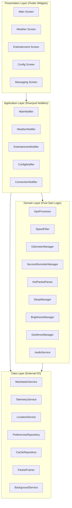

# Architecture and Design

This document describes the architectural design of the Flutter Golf Cart Computer application, including layer responsibilities, component interactions, data flow, and state management patterns.

## Architecture Overview

The application follows a four-layer clean architecture pattern that separates concerns and enables testability at every level.



## Layer Responsibilities

### Presentation Layer

The presentation layer consists of Flutter widgets that render state and capture user input. Widgets are intentionally thin — they observe Riverpod providers and rebuild reactively when state changes. No business logic lives in widgets.

Key screens include the main dashboard (speed, heading, telemetry), weather forecast display, entertainment venue listing, messaging interface, and configuration panel.

### Application Layer

The application layer contains Riverpod StateNotifiers and AsyncNotifiers that coordinate between domain logic and the data layer. These notifiers subscribe to data streams, invoke domain processors, and expose computed state to the presentation layer.

Each notifier manages a specific feature area: MainNotifier handles the dashboard state, WeatherNotifier manages weather data lifecycle, ConnectionNotifier coordinates Bluetooth connections, and ConfigNotifier handles user preferences.

### Domain Layer

The domain layer contains pure Dart classes with zero framework dependencies. This is where all business rules, algorithms, and data transformations live. Domain classes are fully testable without mocks because they operate on plain data types.

Key domain components include the SpeedFilter (GPS noise elimination), HotPacketParser (weather and venue data parsing), OdometerManager (distance accumulation), GeofenceManager (home detection with hysteresis), and BrightnessManager (time-based display control).

### Data Layer

The data layer handles all external communication: Bluetooth Low Energy with the Meshtastic radio, Bluetooth with the GCI telemetry computer, GPS via the device sensor, and local persistence via shared_preferences and Hive.

## Component Interactions

### Bluetooth Data Flow

The application maintains two simultaneous Bluetooth connections:

1. **Meshtastic Radio (BLE):** The MeshtasticService manages the BLE connection using flutter_blue_plus. It handles device scanning, GATT characteristic interactions, protobuf encoding/decoding, and the Meshtastic handshake protocol. Incoming packets are routed by port number to the appropriate handler.

2. **GCI Telemetry (BT/BLE):** The TelemetryService manages the connection to the ESP-32 computer. On Android, it prefers Bluetooth Classic SPP; on iOS, it uses BLE. The service handles a custom binary protocol with 9-byte message headers and typed payloads.

### GPS Data Flow

```
Device GPS Sensor → LocationService → GpsProcessor → SpeedFilter → ProcessedGpsData
                                          ↓
Meshtastic GPS (fallback) ────────────────┘
                                          ↓
                              OdometerManager (distance accumulation)
                              GeofenceManager (home detection)
                              BrightnessManager (activity detection)
                              SleepManager (motion awareness)
```

GPS data flows from the device sensor through the LocationService at 1-second intervals. The GpsProcessor applies speed filtering, heading calculation, satellite debouncing, and HDOP estimation. Processed data feeds into multiple downstream consumers that each apply their own logic.

### Message Data Flow

Incoming Meshtastic text messages are checked for the HoT packet indicator (`|` prefix). Regular messages go to the message history. HoT packets are routed to the HotPacketParser which validates structure and extracts weather or venue/event data. Parsed data is cached locally and displayed on the appropriate screen.

## State Management with Riverpod

The application uses Riverpod for dependency injection and reactive state management. This provides several advantages over alternatives:

- **Compile-time safety:** Provider dependencies are resolved at compile time, eliminating runtime DI errors.
- **Testability:** Providers can be overridden in tests without mocks for domain logic.
- **Reactive propagation:** State changes automatically propagate to dependent providers and widgets.
- **Scoped lifecycle:** Providers are created and disposed based on their usage, preventing memory leaks.

### Provider Organization

Providers are organized by layer and declared in a central `providers.dart` file:

- **Data providers** expose service instances (singletons for the app lifecycle)
- **Domain providers** expose processor instances that depend on data providers
- **Application providers** expose notifiers that coordinate domain and data layers

### State Flow Pattern

```
User Action → Widget → Notifier.method() → Domain Logic → Data Layer
                                                ↓
Widget ← Provider rebuild ← State update ← Result
```

## Key Design Decisions

### Why Riverpod over BLoC or Provider?

Riverpod provides compile-time dependency resolution, better testability through provider overrides, and natural stream composition that maps well to the multiple concurrent data sources in this application (two Bluetooth connections, GPS, timers).

### Why Four Layers Instead of Three?

The Application layer (notifiers) acts as a coordination point between pure domain logic and framework-dependent data services. This keeps domain classes framework-free and fully unit-testable while giving the presentation layer a clean, pre-computed state to render.

### Why flutter_blue_plus?

It offers mature cross-platform BLE support with stream-based APIs that integrate naturally with Riverpod's reactive model. The plugin handles platform differences in BLE permission models and connection lifecycle.

### Why Protobuf with Code Generation?

The Meshtastic protocol uses Protocol Buffers as its wire format. Using `protoc-gen-dart` to generate Dart classes from the official `.proto` files ensures type-safe serialization that stays in sync with the Meshtastic specification.

### Why Hive for Caching?

Hive provides efficient binary storage for structured cached data (weather packets, venue data) without the overhead of SQLite. It works well for the relatively simple cache-by-date pattern used in this application.
