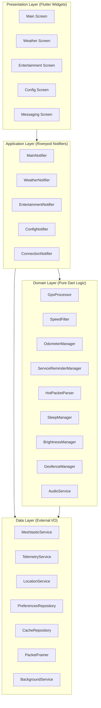

# Architecture and Design

This document describes the architectural design of the Flutter Golf Cart Computer application, including layer responsibilities, component interactions, data flow, state management patterns, and key design decisions.

## Architecture Overview

The application follows a four-layer clean architecture pattern that separates concerns and enables testability at every level. Each layer has a clear responsibility and communicates with adjacent layers through well-defined interfaces.



## Layer Responsibilities

### Presentation Layer

The presentation layer consists of Flutter widgets that render state and capture user input. Widgets are intentionally thin — they observe Riverpod providers and rebuild reactively when state changes. No business logic lives in widgets.

Key responsibilities:
- Render current application state from providers
- Capture user gestures and delegate to notifier methods
- Manage navigation between screens
- Apply Material Design 3 theming consistently
- Implement responsive layouts that adapt to screen size and orientation
- Ensure accessibility with appropriate semantics and contrast ratios

Key screens:
- **MainScreen** — Primary dashboard with speed, heading, telemetry, time, and status indicators
- **WeatherScreen** — Current temperature and 4-hour forecast display
- **EntertainmentScreen** — Venue/event schedule in a scrollable two-column table
- **ConfigScreen** — All user-adjustable settings and system controls
- **MessagingScreen** — Mesh message history and send interface

### Application Layer

The application layer contains Riverpod StateNotifiers and AsyncNotifiers that coordinate between domain logic and the data layer. These notifiers subscribe to data streams, invoke domain processors, and expose computed state to the presentation layer.

Key responsibilities:
- Subscribe to data layer streams (Bluetooth, GPS, timers)
- Invoke domain processors with raw data
- Manage feature-specific state lifecycles
- Coordinate cross-cutting concerns (e.g., at-home status affecting multiple systems)
- Handle error states and recovery logic
- Trigger audio feedback for user actions and system events

Each notifier manages a specific feature area:
- **MainNotifier** — Dashboard state aggregation from GPS, telemetry, odometer, and system managers
- **WeatherNotifier** — Weather data lifecycle (receive, parse, cache, display)
- **EntertainmentNotifier** — Venue/event data lifecycle
- **ConnectionNotifier** — Bluetooth connection state for both Meshtastic and GCI
- **ConfigNotifier** — User preferences with debounced persistence

### Domain Layer

The domain layer contains pure Dart classes with zero framework dependencies. This is where all business rules, algorithms, and data transformations live. Domain classes are fully testable without mocks because they operate on plain data types.

Key responsibilities:
- Implement business rules and algorithms
- Transform raw data into meaningful application state
- Enforce invariants and validation rules
- Provide deterministic, side-effect-free computations where possible

Key domain components:
- **SpeedFilter** — GPS noise elimination with dither suppression, spike rejection, and stop detection
- **GpsProcessor** — Heading calculation, satellite debouncing, HDOP estimation, dual-source GPS management
- **HotPacketParser** — Weather and venue/event data parsing with structural validation
- **OdometerManager** — Distance accumulation with speed gating, minimum thresholds, and rollover
- **ServiceReminderManager** — Driving hours tracking with time delta validation
- **GeofenceManager** — Home detection using Haversine distance with hysteresis band
- **BrightnessManager** — Time-based display brightness with inactivity timeout
- **SleepManager** — Three-state power management (Startup Grace, GCI Mode, Standalone Mode)
- **AudioService** — Tone playback with volume control and distinct event categories

### Data Layer

The data layer handles all external communication: Bluetooth Low Energy with the Meshtastic radio, Bluetooth with the GCI telemetry computer, GPS via the device sensor, and local persistence via shared_preferences and Hive.

Key responsibilities:
- Manage Bluetooth connections and protocol handling
- Interface with platform GPS services
- Persist and retrieve data from local storage
- Handle platform-specific differences (BLE vs Classic, foreground services vs background modes)
- Provide stream-based APIs for reactive consumption by upper layers

Key data components:
- **MeshtasticService** — BLE connection, protobuf encoding/decoding, Meshtastic handshake, message routing
- **TelemetryService** — GCI connection, custom binary protocol, heartbeat management, pairing
- **LocationService** — GPS position stream via geolocator plugin
- **PreferencesRepository** — User settings persistence with debouncing and defaults
- **CacheRepository** — Weather/venue data caching with date-based validation using Hive
- **PacketFramer** — 4-byte length-prefix framing and MTU-based packet splitting
- **BackgroundService** — Platform-specific background execution (foreground service on Android, background modes on iOS)

## Component Interactions

### Bluetooth Data Flow

The application maintains two simultaneous Bluetooth connections with independent lifecycle management:

**Meshtastic Radio (BLE):**
```
Scan → Connect → Subscribe FROMNUM → Handshake → Steady State
                                                       │
                                          ┌────────────┼────────────┐
                                          ▼            ▼            ▼
                                    Text Messages  HoT Packets  Position Data
                                          │            │            │
                                          ▼            ▼            ▼
                                    MessageHistory  Parser→Cache  GpsProcessor
```

The MeshtasticService manages the BLE connection using flutter_blue_plus. It handles device scanning (name pattern matching), GATT characteristic interactions (TORADIO write, FROMRADIO read, FROMNUM notify), protobuf encoding/decoding, and the Meshtastic handshake protocol. Incoming packets are routed by port number to the appropriate handler.

**GCI Telemetry (BT/BLE):**
```
Pair/Connect → Heartbeat Loop → Receive Telemetry → Parse 20-byte Payload
                    │                                        │
                    ▼                                        ▼
              Send GPS Data                          Display: Voltage, Fuel,
              Send IsHome                            Temperature, Headlights
              Send IsDaytime
```

The TelemetryService manages the connection to the ESP-32 computer. On Android, it prefers Bluetooth Classic SPP for reliability; on iOS, it uses BLE (iOS does not expose Classic Bluetooth to apps). The service handles a custom binary protocol with 9-byte message headers and typed payloads.

### GPS Data Flow

```
Device GPS Sensor (1s interval)
         │
         ▼
    LocationService
         │
         ▼
    GpsProcessor ◄──── Meshtastic GPS (fallback when device GPS unavailable)
         │
         ├──→ SpeedFilter ──→ Filtered speed (dither, spike, stop detection)
         │
         ├──→ Heading calculation (bearing → 16-point cardinal)
         │
         ├──→ Satellite debounce (3 consecutive zeros before displaying 0)
         │
         └──→ HDOP estimation (≥6 sats=1.5, 4-5=2.0, <4=99.0)
                  │
                  ▼
         ProcessedGpsData stream
                  │
    ┌─────────────┼─────────────────────────────┐
    ▼             ▼                ▼             ▼
OdometerManager  GeofenceManager  BrightnessManager  SleepManager
(distance)       (home detection) (activity detect)  (motion aware)
```

GPS data flows from the device sensor through the LocationService at 1-second intervals. The GpsProcessor applies speed filtering, heading calculation, satellite debouncing, and HDOP estimation. Processed data feeds into multiple downstream consumers that each apply their own logic independently.

### Message Data Flow

```
Incoming Meshtastic MeshPacket (TEXT_MESSAGE_APP port)
         │
         ▼
    Check for HoT indicator (leading '|' character)
         │
    ┌────┴────┐
    ▼         ▼
Regular    HoT Packet
Message        │
    │     ┌────┴────┐
    │     ▼         ▼
    │   Type 01   Type 02
    │   Weather   Venue/Event
    │     │         │
    │     ▼         ▼
    │   Validate  Validate
    │   (7# 12,)  (pairs with ,)
    │     │         │
    │     ▼         ▼
    │   Parse →   Parse →
    │   Cache     Cache
    │     │         │
    ▼     ▼         ▼
Message  Weather   Entertainment
History  Screen    Screen
```

Incoming Meshtastic text messages are checked for the HoT packet indicator (`|` prefix). Regular messages go to the message history with sender node ID, channel, and timestamp. HoT packets are routed to the HotPacketParser which validates structure (delimiter counts, field ranges) and extracts weather or venue/event data. Parsed data is cached locally with a date stamp and displayed on the appropriate screen.

### State Coordination Flow

Several system behaviors require coordination across multiple components:

**At-Home Status Change:**
```
GeofenceManager detects transition
         │
         ├──→ Notify GCI (send isHome boolean)
         ├──→ Update Meshtastic GPS interval (8s away, 120s home)
         └──→ Update GPS processor interval
```

**Brightness Management:**
```
Time changes (sunrise/sunset boundary)
         │
         ▼
BrightnessManager selects day/night level
         │
         ▼
Platform channel → native brightness API
         │
Inactivity timeout expires
         │
         ▼
Dim to off → Wait for touch or movement → Restore
```

## State Management with Riverpod

The application uses Riverpod for dependency injection and reactive state management. This provides several advantages over alternatives:

- **Compile-time safety:** Provider dependencies are resolved at compile time, eliminating runtime DI errors.
- **Testability:** Providers can be overridden in tests without mocks for domain logic.
- **Reactive propagation:** State changes automatically propagate to dependent providers and widgets.
- **Scoped lifecycle:** Providers are created and disposed based on their usage, preventing memory leaks.
- **Stream composition:** Multiple concurrent data sources (two Bluetooth connections, GPS, timers) compose naturally.

### Provider Organization

Providers are organized by layer and declared in a central `providers.dart` file:

```dart
// Data providers (singletons for app lifecycle)
final meshtasticServiceProvider = Provider<MeshtasticService>((ref) => ...);
final telemetryServiceProvider = Provider<TelemetryService>((ref) => ...);
final locationServiceProvider = Provider<LocationService>((ref) => ...);
final preferencesRepositoryProvider = Provider<PreferencesRepository>((ref) => ...);
final cacheRepositoryProvider = Provider<CacheRepository>((ref) => ...);

// Domain providers (depend on data providers)
final gpsProcessorProvider = Provider<GpsProcessor>((ref) => ...);
final odometerManagerProvider = Provider<OdometerManager>((ref) => ...);
final geofenceManagerProvider = Provider<GeofenceManager>((ref) => ...);

// Application providers (coordinate domain + data)
final mainNotifierProvider = StateNotifierProvider<MainNotifier, MainState>((ref) => ...);
final weatherNotifierProvider = StateNotifierProvider<WeatherNotifier, WeatherState>((ref) => ...);
final connectionNotifierProvider = StateNotifierProvider<ConnectionNotifier, ConnectionState>((ref) => ...);
```

### State Flow Pattern

```
User Action → Widget → Notifier.method() → Domain Logic → Data Layer
                                                ↓
Widget ← Provider rebuild ← State update ← Result
```

For stream-based data (GPS, Bluetooth):
```
Data Layer emits stream event
         ↓
Notifier subscription receives event
         ↓
Domain processor transforms data
         ↓
Notifier updates state
         ↓
Provider notifies dependents
         ↓
Widget rebuilds with new state
```

### Error Handling Pattern

Errors are handled at the application layer and exposed as state:

```dart
class ConnectionState {
  final BluetoothStatus meshtastic; // Connected, Disconnected, Connecting, Reconnecting
  final BluetoothStatus gci;
  final String? lastError;          // User-facing error message
}
```

Domain layer methods return result types or throw domain-specific exceptions that the application layer catches and translates into user-facing state.

## Responsive Layout Architecture

The presentation layer implements a responsive design system that adapts to different screen sizes and orientations:

### Breakpoint System

| Breakpoint | Width | Layout |
|-----------|-------|--------|
| Compact | < 800px | Single column, stacked widgets, scrollable |
| Medium | 800-1024px | Two-column dashboard, essential info prioritized |
| Expanded | > 1024px | Multi-column with all widgets visible |

### Layout Strategy

- **LayoutBuilder** wraps major screen sections to respond to actual available space
- **MediaQuery** provides device dimensions and orientation for top-level layout decisions
- **Flex widgets** (Row, Column, Wrap) with flex factors ensure proportional sizing
- **Minimum constraints** ensure touch targets never shrink below 44x44dp
- **Text scaling** uses relative sizes that scale with screen dimensions while respecting minimum legibility thresholds

### Orientation Handling

Portrait and landscape orientations use different arrangements of the same widgets:
- **Portrait:** Vertical stack with speed/heading prominent at top, secondary info below
- **Landscape:** Side-by-side layout with speed/heading on one side, telemetry/status on the other

Orientation changes trigger a layout rebuild without losing state — all data continues flowing through providers regardless of UI arrangement.

## Key Design Decisions

### Why Riverpod over BLoC or Provider?

Riverpod provides compile-time dependency resolution, better testability through provider overrides, and natural stream composition that maps well to the multiple concurrent data sources in this application (two Bluetooth connections, GPS, timers). Unlike BLoC, it doesn't require boilerplate event/state classes for simple state management. Unlike Provider (the package), it doesn't depend on the widget tree for scoping.

### Why Four Layers Instead of Three?

The Application layer (notifiers) acts as a coordination point between pure domain logic and framework-dependent data services. This keeps domain classes framework-free and fully unit-testable while giving the presentation layer a clean, pre-computed state to render. Without this layer, widgets would need to subscribe to multiple streams and coordinate logic themselves, or domain classes would need framework dependencies.

### Why flutter_blue_plus?

It offers mature cross-platform BLE support with stream-based APIs that integrate naturally with Riverpod's reactive model. The plugin handles platform differences in BLE permission models and connection lifecycle. It supports MTU negotiation, which is critical for efficient Meshtastic packet transfer. The active maintenance and community support reduce the risk of platform compatibility issues.

### Why Protobuf with Code Generation?

The Meshtastic protocol uses Protocol Buffers as its wire format. Using `protoc-gen-dart` to generate Dart classes from the official `.proto` files ensures type-safe serialization that stays in sync with the Meshtastic specification. Manual serialization would be error-prone and difficult to maintain as the Meshtastic protocol evolves.

### Why Hive for Caching?

Hive provides efficient binary storage for structured cached data (weather packets, venue data) without the overhead of SQLite. It works well for the relatively simple cache-by-date pattern used in this application. Hive is also pure Dart (no native dependencies beyond initialization), which simplifies the build process and cross-platform compatibility.

### Why shared_preferences for Settings?

User preferences are simple key-value pairs (integers, booleans, strings) that don't benefit from Hive's binary storage. shared_preferences provides a familiar, well-tested API for this use case and integrates cleanly with the debounced write pattern used for slider/spinner values.

### Why a Custom Binary Protocol for GCI?

The GCI ESP-32 uses a custom 9-byte header protocol rather than a standard like protobuf because:
- The ESP-32 has limited memory and processing power
- The telemetry payload is fixed-size (20 bytes) and doesn't benefit from schema evolution
- The protocol predates the Flutter rewrite and must remain compatible with the existing ESP-32 firmware
- Binary parsing is straightforward and efficient for the small, well-defined message set

### Why Haversine for Geofencing?

The Haversine formula provides sufficient accuracy for geofence calculations at the distances involved (100-5000 meters). More complex geodesic calculations (Vincenty) would add computational cost without meaningful accuracy improvement at these scales. The 50-meter hysteresis band is much larger than any Haversine approximation error at these distances.

### Why Property-Based Testing?

Many domain algorithms have mathematical properties that should hold for all valid inputs (e.g., frame then unframe produces the original, speed below threshold always maps to zero). Property-based tests with the `glados` package verify these invariants across thousands of random inputs, catching edge cases that example-based tests might miss. This is particularly valuable for the speed filter, packet parser, and distance accumulation logic.
